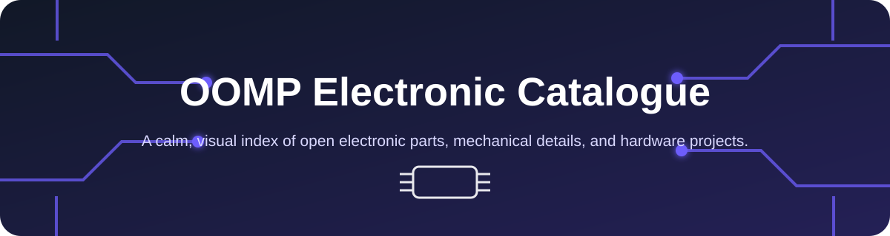

<!-- Generated by generate_pretty_repository.py; edit the source metadata or configuration. -->

**A calm, visual index of open electronic parts, mechanical details, and hardware projects.**

[Browse the catalogue](catalogue/README.md) · [Open the full source repository](https://github.com/oomlout/oomp_electronic_version_5)

## Find what you need

| Collection | Inside |
| --- | --- |
| ⚡ **[Electronic](catalogue/electronic/README.md)** | 1,194 components |
| ⚙️ **[Mechanical](catalogue/mechanical/README.md)** | 50 mechanical items |
| 🧭 **[OOMP](catalogue/oomp/README.md)** | 915 projects |

## Designed for browsing

Start broad and follow the taxonomy until you reach the exact part or board. Every record appears **once** in the tree, every page carries its context as a breadcrumb, and every concise entry links back to the complete source record.

- **Visual:** every part and project has a display-ready, locally stored PNG.
- **Focused:** high-value metadata is surfaced before implementation detail.
- **Traceable:** “Full details” always opens the canonical page in the original repository.
- **Explorable:** every project links to a GitHub Pages HTML board explorer; processed boards retain the full interactive explorer.
- **Reproducible:** run `rebuild.bat` here, or `generate_pretty_repository.bat` in the source checkout.

## What stays in the full repository

KiCad source, footprints, symbols, manufacturing files, large render sets, working YAML, and generation intermediates remain in the [complete OOMP repository](https://github.com/oomlout/oomp_electronic_version_5). This repository is its welcoming, README-first front door.

## Publishing the explorers

In the repository's **Settings → Pages**, select **GitHub Actions** as the source. The included static Pages workflow publishes the repository after each push to `main`, while `.nojekyll` keeps the self-contained HTML explorers intact. Explorer links are configured for [https://oomlout.github.io/oomp_electronic_verison_5_pretty](https://oomlout.github.io/oomp_electronic_verison_5_pretty).

---

Generated from OOMP metadata. See [build information](BUILD_INFO.md).
