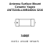

<!-- Generated item page. Full data lives in the source repository. -->
[Catalogue](../../../../../../../README.md) / [Electronic](../../../../../../README.md) / [Antenna](../../../../../README.md) / [3216](../../../../README.md) / [Surface Mount](../../../README.md) / [Ceramic](../../README.md) / [Yageo](../README.md) / Ant3216ll00r2400a

# ⚡ Antenna Surface Mount Ceramic Yageo ANT3216LL00R2400A 3216

> Antenna Surface Mount Ceramic Yageo ANT3216LL00R2400A 3216 is an OOMP electronic antenna definition. It uses the 3216 package or form factor. Its nominal drawing size is 3.2 × 1.6 mm. The definition includes 2 documented pins.

**[Full details →](https://github.com/oomlout/oomp_electronic_version_5/tree/main/parts/electronic_antenna_3216_surface_mount_ceramic_yageo_ant3216ll00r2400a)**

## At a glance

| Detail | Value |
| --- | --- |
| Type | Antenna |
| Package / style | 3216 |
| Nominal size | 3.2 × 1.6 mm |
| Documented pins | 2 |
| OOMP ID | `electronic_antenna_3216_surface_mount_ceramic_yageo_ant3216ll00r2400a` |

## Catalogue location

`Electronic › Antenna › 3216 › Surface Mount › Ceramic › Yageo › Ant3216ll00r2400a`

## About this page

This is the compact catalogue view. A detailed source README is available. Schematics, fabrication data, working metadata, alternate diagrams, availability data, and project analysis stay with the [full original record](https://github.com/oomlout/oomp_electronic_version_5/tree/main/parts/electronic_antenna_3216_surface_mount_ceramic_yageo_ant3216ll00r2400a).

---

[↑ Parent category](../README.md) · [Catalogue home](../../../../../../../README.md)
