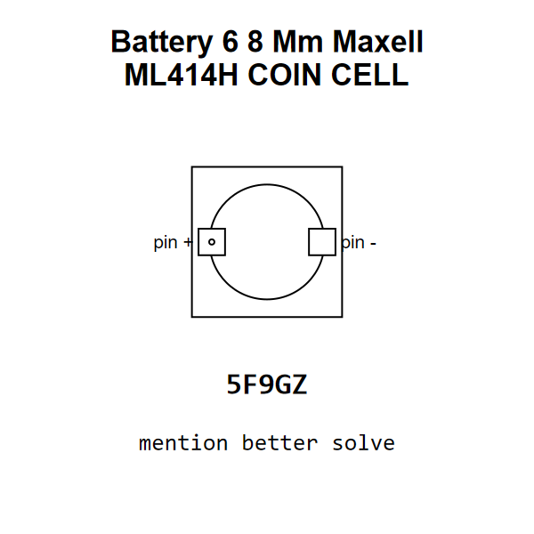

<!-- Generated item page. Full data lives in the source repository. -->
[Catalogue](../../../../../../README.md) / [Electronic](../../../../../README.md) / [Battery](../../../../README.md) / [Coin Cell](../../../README.md) / [6 8 Mm](../../README.md) / [Maxell](../README.md) / Ml414h

# ⚡ Battery 6 8 Mm Maxell ML414H COIN CELL

> Battery 6 8 Mm Maxell ML414H COIN CELL is an OOMP electronic battery definition. It uses the coin cell package or form factor. Its nominal drawing size is 6.8 × 6.8 mm. The definition includes 2 documented pins.

[Full details →](https://github.com/oomlout/oomp_electronic_version_5/tree/main/parts/electronic_battery_coin_cell_6_8_mm_maxell_ml414h)

## At a glance

| Detail | Value |
| --- | --- |
| Type | Battery |
| Package / style | coin cell |
| Nominal size | 6.8 × 6.8 mm |
| Documented pins | 2 |
| OOMP ID | `electronic_battery_coin_cell_6_8_mm_maxell_ml414h` |

## Catalogue location

`Electronic › Battery › Coin Cell › 6 8 Mm › Maxell › Ml414h`

## About this page

This is the compact catalogue view. A detailed source README is available. Schematics, fabrication data, working metadata, alternate diagrams, availability data, and project analysis stay with the [full original record](https://github.com/oomlout/oomp_electronic_version_5/tree/main/parts/electronic_battery_coin_cell_6_8_mm_maxell_ml414h).

---

[↑ Parent category](../README.md) · [Catalogue home](../../../../../../README.md)
