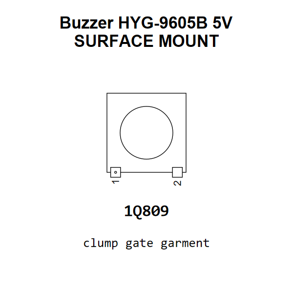

<!-- Generated item page. Full data lives in the source repository. -->
[Catalogue](../../../../../README.md) / [Electronic](../../../../README.md) / [Buzzer](../../../README.md) / [Surface Mount](../../README.md) / [Hydz](../README.md) / Hyg9605b

# ⚡ Buzzer HYG-9605B 5V SURFACE MOUNT

> Buzzer HYG-9605B 5V SURFACE MOUNT is an OOMP electronic buzzer definition. It uses the surface mount package or form factor. Its nominal drawing size is 9.6 × 9.6 mm. The definition includes 2 documented pins.

[Full details →](https://github.com/oomlout/oomp_electronic_version_5/tree/main/parts/electronic_buzzer_surface_mount_hydz_hyg9605b)

## At a glance

| Detail | Value |
| --- | --- |
| Type | Buzzer |
| Package / style | surface mount |
| Nominal size | 9.6 × 9.6 mm |
| Documented pins | 2 |
| OOMP ID | `electronic_buzzer_surface_mount_hydz_hyg9605b` |

## Catalogue location

`Electronic › Buzzer › Surface Mount › Hydz › Hyg9605b`

## About this page

This is the compact catalogue view. A detailed source README is available. Schematics, fabrication data, working metadata, alternate diagrams, availability data, and project analysis stay with the [full original record](https://github.com/oomlout/oomp_electronic_version_5/tree/main/parts/electronic_buzzer_surface_mount_hydz_hyg9605b).

---

[↑ Parent category](../README.md) · [Catalogue home](../../../../../README.md)
