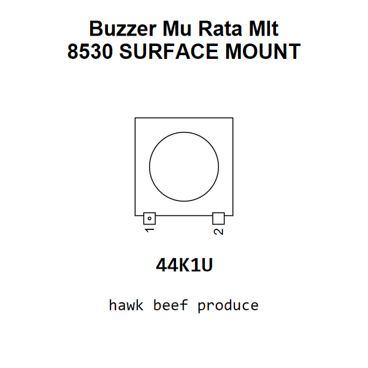

<!-- Generated item page. Full data lives in the source repository. -->
[Catalogue](../../../../../README.md) / [Electronic](../../../../README.md) / [Buzzer](../../../README.md) / [Surface Mount](../../README.md) / [Mu Rata](../README.md) / Mlt 8530

# ⚡ Buzzer Mu Rata Mlt 8530 SURFACE MOUNT

> Buzzer Mu Rata Mlt 8530 SURFACE MOUNT is an OOMP electronic buzzer definition. It uses the surface mount package or form factor. Its nominal drawing size is 8.5 × 8.5 mm. The definition includes 2 documented pins.

[Full details →](https://github.com/oomlout/oomp_electronic_version_5/tree/main/parts/electronic_buzzer_surface_mount_mu_rata_mlt_8530)

## At a glance

| Detail | Value |
| --- | --- |
| Type | Buzzer |
| Package / style | surface mount |
| Nominal size | 8.5 × 8.5 mm |
| Documented pins | 2 |
| OOMP ID | `electronic_buzzer_surface_mount_mu_rata_mlt_8530` |

## Catalogue location

`Electronic › Buzzer › Surface Mount › Mu Rata › Mlt 8530`

## About this page

This is the compact catalogue view. A detailed source README is available. Schematics, fabrication data, working metadata, alternate diagrams, availability data, and project analysis stay with the [full original record](https://github.com/oomlout/oomp_electronic_version_5/tree/main/parts/electronic_buzzer_surface_mount_mu_rata_mlt_8530).

---

[↑ Parent category](../README.md) · [Catalogue home](../../../../../README.md)
