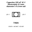

<!-- Generated item page. Full data lives in the source repository. -->
[Catalogue](../../../../../../README.md) / [Electronic](../../../../../README.md) / [Capacitor](../../../../README.md) / [6 3 Mm Diameter 5 4 Mm Tall](../../../README.md) / [Electrolytic](../../README.md) / [220 Micro Farad](../README.md) / 10 Volt

# ⚡ Capacitor 220 uF 10 V Electrolytic 6.3 mm diameter x 5.4 mm tall

> Capacitor 220 uF 10 V Electrolytic 6.3 mm diameter x 5.4 mm tall is an OOMP electronic capacitor definition. It uses the 6 3 mm diameter 5 4 mm tall package or form factor. Its nominal drawing size is 6.3 × 6.3 mm.

**[Full details →](https://github.com/oomlout/oomp_electronic_version_5/tree/main/parts/electronic_capacitor_6_3_mm_diameter_5_4_mm_tall_electrolytic_220_micro_farad_10_volt)**

## At a glance

| Detail | Value |
| --- | --- |
| Type | Capacitor |
| Package / style | 6 3 mm diameter 5 4 mm tall |
| Nominal size | 6.3 × 6.3 mm |
| OOMP ID | `electronic_capacitor_6_3_mm_diameter_5_4_mm_tall_electrolytic_220_micro_farad_10_volt` |

## Catalogue location

`Electronic › Capacitor › 6 3 Mm Diameter 5 4 Mm Tall › Electrolytic › 220 Micro Farad › 10 Volt`

## About this page

This is the compact catalogue view. A detailed source README is available. Schematics, fabrication data, working metadata, alternate diagrams, availability data, and project analysis stay with the [full original record](https://github.com/oomlout/oomp_electronic_version_5/tree/main/parts/electronic_capacitor_6_3_mm_diameter_5_4_mm_tall_electrolytic_220_micro_farad_10_volt).

---

[↑ Parent category](../README.md) · [Catalogue home](../../../../../../README.md)
