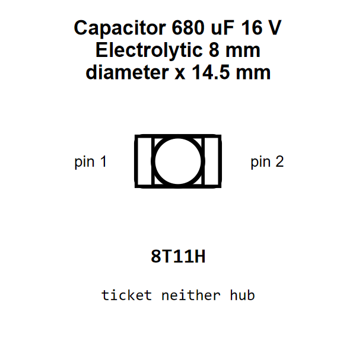

<!-- Generated item page. Full data lives in the source repository. -->
[Catalogue](../../../../../../README.md) / [Electronic](../../../../../README.md) / [Capacitor](../../../../README.md) / [8 Mm Diameter 14 5 Mm Tall](../../../README.md) / [Electrolytic](../../README.md) / [680 Micro Farad](../README.md) / 16 Volt

# ⚡ Capacitor 680 uF 16 V Electrolytic 8 mm diameter x 14.5 mm tall

> Capacitor 680 uF 16 V Electrolytic 8 mm diameter x 14.5 mm tall is an OOMP electronic capacitor definition. It uses the 8 mm diameter 14 5 mm tall package or form factor. Its nominal drawing size is 10.0 × 5.0 mm.

[Full details →](https://github.com/oomlout/oomp_electronic_version_5/tree/main/parts/electronic_capacitor_8_mm_diameter_14_5_mm_tall_electrolytic_680_micro_farad_16_volt)

## At a glance

| Detail | Value |
| --- | --- |
| Type | Capacitor |
| Package / style | 8 mm diameter 14 5 mm tall |
| Nominal size | 10.0 × 5.0 mm |
| OOMP ID | `electronic_capacitor_8_mm_diameter_14_5_mm_tall_electrolytic_680_micro_farad_16_volt` |

## Catalogue location

`Electronic › Capacitor › 8 Mm Diameter 14 5 Mm Tall › Electrolytic › 680 Micro Farad › 16 Volt`

## About this page

This is the compact catalogue view. A detailed source README is available. Schematics, fabrication data, working metadata, alternate diagrams, availability data, and project analysis stay with the [full original record](https://github.com/oomlout/oomp_electronic_version_5/tree/main/parts/electronic_capacitor_8_mm_diameter_14_5_mm_tall_electrolytic_680_micro_farad_16_volt).

---

[↑ Parent category](../README.md) · [Catalogue home](../../../../../../README.md)
