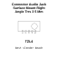

<!-- Generated item page. Full data lives in the source repository. -->
[Catalogue](../../../../../../../README.md) / [Electronic](../../../../../../README.md) / [Connector](../../../../../README.md) / [Audio Jack](../../../../README.md) / [Surface Mount Right Angle](../../../README.md) / [Trrs](../../README.md) / [3 5 Mm](../README.md) / Audio Jack 3 5 Mm Trrs

# ⚡ Connector Audio Jack Surface Mount Right Angle Trrs 3 5 Mm Audio Jack

> Connector Audio Jack Surface Mount Right Angle Trrs 3 5 Mm Audio Jack 3 5 Mm Trrs is an OOMP electronic connector definition. It uses the audio jack package or form factor. Its nominal drawing size is 13.5 × 6.5 mm. The definition includes 5 documented pins.

**[Full details →](https://github.com/oomlout/oomp_electronic_version_5/tree/main/parts/electronic_connector_audio_jack_surface_mount_right_angle_trrs_3_5_mm_audio_jack_3_5_mm_trrs)**

## At a glance

| Detail | Value |
| --- | --- |
| Type | Connector |
| Package / style | audio jack |
| Nominal size | 13.5 × 6.5 mm |
| Documented pins | 5 |
| OOMP ID | `electronic_connector_audio_jack_surface_mount_right_angle_trrs_3_5_mm_audio_jack_3_5_mm_trrs` |

## Catalogue location

`Electronic › Connector › Audio Jack › Surface Mount Right Angle › Trrs › 3 5 Mm › Audio Jack 3 5 Mm Trrs`

## About this page

This is the compact catalogue view. A detailed source README is available. Schematics, fabrication data, working metadata, alternate diagrams, availability data, and project analysis stay with the [full original record](https://github.com/oomlout/oomp_electronic_version_5/tree/main/parts/electronic_connector_audio_jack_surface_mount_right_angle_trrs_3_5_mm_audio_jack_3_5_mm_trrs).

---

[↑ Parent category](../README.md) · [Catalogue home](../../../../../../../README.md)
