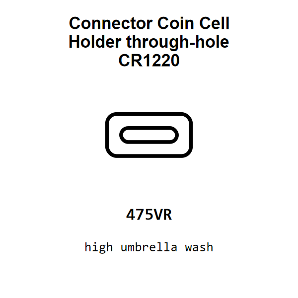

<!-- Generated item page. Full data lives in the source repository. -->
[Catalogue](../../../../../README.md) / [Electronic](../../../../README.md) / [Connector](../../../README.md) / [Coin Cell Holder](../../README.md) / [Through Hole](../README.md) / Cr1220

# ⚡ Connector Coin Cell Holder through-hole CR1220

> Connector Coin Cell Holder through-hole CR1220 is an OOMP electronic connector definition. It uses the coin cell holder package or form factor. Its nominal drawing size is 10.0 × 5.0 mm.

[Full details →](https://github.com/oomlout/oomp_electronic_version_5/tree/main/parts/electronic_connector_coin_cell_holder_through_hole_cr1220)

## At a glance

| Detail | Value |
| --- | --- |
| Type | Connector |
| Package / style | coin cell holder |
| Nominal size | 10.0 × 5.0 mm |
| OOMP ID | `electronic_connector_coin_cell_holder_through_hole_cr1220` |

## Catalogue location

`Electronic › Connector › Coin Cell Holder › Through Hole › Cr1220`

## About this page

This is the compact catalogue view. A detailed source README is available. Schematics, fabrication data, working metadata, alternate diagrams, availability data, and project analysis stay with the [full original record](https://github.com/oomlout/oomp_electronic_version_5/tree/main/parts/electronic_connector_coin_cell_holder_through_hole_cr1220).

---

[↑ Parent category](../README.md) · [Catalogue home](../../../../../README.md)
