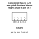

<!-- Generated item page. Full data lives in the source repository. -->
[Catalogue](../../../../../../../../README.md) / [Electronic](../../../../../../../README.md) / [Connector](../../../../../../README.md) / [Easyc](../../../../../README.md) / [1 25 Mm Pitch](../../../../README.md) / [Surface Mount Right Angle](../../../README.md) / [4 Pin](../../README.md) / [JST](../README.md) / Sm04b Gh Tf

# ⚡ Connector Easyc 1.25 mm pitch Surface Mount Right Angle 4 pin JST

> Connector Easyc 1.25 mm pitch Surface Mount Right Angle 4 pin JST is an OOMP electronic connector definition. It uses the easyc package or form factor. Its nominal drawing size is 5.4 × 4.0 mm. The definition includes 4 documented pins.

**[Full details →](https://github.com/oomlout/oomp_electronic_version_5/tree/main/parts/electronic_connector_easyc_1_25_mm_pitch_surface_mount_right_angle_4_pin_jst_sm04b_gh_tf)**

## At a glance

| Detail | Value |
| --- | --- |
| Type | Connector |
| Package / style | easyc |
| Nominal size | 5.4 × 4.0 mm |
| Documented pins | 4 |
| OOMP ID | `electronic_connector_easyc_1_25_mm_pitch_surface_mount_right_angle_4_pin_jst_sm04b_gh_tf` |

## Catalogue location

`Electronic › Connector › Easyc › 1 25 Mm Pitch › Surface Mount Right Angle › 4 Pin › JST › Sm04b Gh Tf`

## About this page

This is the compact catalogue view. A detailed source README is available. Schematics, fabrication data, working metadata, alternate diagrams, availability data, and project analysis stay with the [full original record](https://github.com/oomlout/oomp_electronic_version_5/tree/main/parts/electronic_connector_easyc_1_25_mm_pitch_surface_mount_right_angle_4_pin_jst_sm04b_gh_tf).

---

[↑ Parent category](../README.md) · [Catalogue home](../../../../../../../../README.md)
