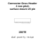

<!-- Generated item page. Full data lives in the source repository. -->
[Catalogue](../../../../../../../../README.md) / [Electronic](../../../../../../../README.md) / [Connector](../../../../../../README.md) / [Gnss Header](../../../../../README.md) / [2 Mm Pitch](../../../../README.md) / [Surface Mount](../../../README.md) / [20 Pin](../../README.md) / [Plug In](../README.md) / Conn 02x10 Gnss Plug In Header

# ⚡ Connector Gnss Header 2 mm pitch surface-mount 20 pin Plug In

> Connector Gnss Header 2 mm pitch surface-mount 20 pin Plug In is an OOMP electronic connector definition. It uses the gnss header package or form factor. Its nominal drawing size is 20.0 × 5.0 mm. The definition includes 20 documented pins.

**[Full details →](https://github.com/oomlout/oomp_electronic_version_5/tree/main/parts/electronic_connector_gnss_header_2_mm_pitch_surface_mount_20_pin_plug_in_conn_02x10_gnss_plug_in_header)**

## At a glance

| Detail | Value |
| --- | --- |
| Type | Connector |
| Package / style | gnss header |
| Nominal size | 20.0 × 5.0 mm |
| Documented pins | 20 |
| OOMP ID | `electronic_connector_gnss_header_2_mm_pitch_surface_mount_20_pin_plug_in_conn_02x10_gnss_plug_in_header` |

## Catalogue location

`Electronic › Connector › Gnss Header › 2 Mm Pitch › Surface Mount › 20 Pin › Plug In › Conn 02x10 Gnss Plug In Header`

## About this page

This is the compact catalogue view. A detailed source README is available. Schematics, fabrication data, working metadata, alternate diagrams, availability data, and project analysis stay with the [full original record](https://github.com/oomlout/oomp_electronic_version_5/tree/main/parts/electronic_connector_gnss_header_2_mm_pitch_surface_mount_20_pin_plug_in_conn_02x10_gnss_plug_in_header).

---

[↑ Parent category](../README.md) · [Catalogue home](../../../../../../../../README.md)
