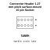

<!-- Generated item page. Full data lives in the source repository. -->
[Catalogue](../../../../../../../../README.md) / [Electronic](../../../../../../../README.md) / [Connector](../../../../../../README.md) / [Header](../../../../../README.md) / [1 27 Mm Pitch](../../../../README.md) / [Surface Mount](../../../README.md) / [10 Pin](../../README.md) / [Socket](../README.md) / Header Female 5x2 1 27 Mm Smd

# ⚡ Connector Header 1.27 mm pitch surface-mount 10 pin Socket

> Connector Header 1.27 mm pitch surface-mount 10 pin Socket is an OOMP electronic connector definition. It uses the header package or form factor. Its nominal drawing size is 7.0 × 5.5 mm. The definition includes 10 documented pins.

**[Full details →](https://github.com/oomlout/oomp_electronic_version_5/tree/main/parts/electronic_connector_header_1_27_mm_pitch_surface_mount_10_pin_socket_header_female_5x2_1_27_mm_smd)**

## At a glance

| Detail | Value |
| --- | --- |
| Type | Connector |
| Package / style | header |
| Nominal size | 7.0 × 5.5 mm |
| Documented pins | 10 |
| OOMP ID | `electronic_connector_header_1_27_mm_pitch_surface_mount_10_pin_socket_header_female_5x2_1_27_mm_smd` |

## Catalogue location

`Electronic › Connector › Header › 1 27 Mm Pitch › Surface Mount › 10 Pin › Socket › Header Female 5x2 1 27 Mm Smd`

## About this page

This is the compact catalogue view. A detailed source README is available. Schematics, fabrication data, working metadata, alternate diagrams, availability data, and project analysis stay with the [full original record](https://github.com/oomlout/oomp_electronic_version_5/tree/main/parts/electronic_connector_header_1_27_mm_pitch_surface_mount_10_pin_socket_header_female_5x2_1_27_mm_smd).

---

[↑ Parent category](../README.md) · [Catalogue home](../../../../../../../../README.md)
