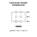

<!-- Generated item page. Full data lives in the source repository. -->
[Catalogue](../../../../../../../../README.md) / [Electronic](../../../../../../../README.md) / [Connector](../../../../../../README.md) / [Header](../../../../../README.md) / [2 54 Mm Pitch](../../../../README.md) / [Surface Mount](../../../README.md) / [Dual Row 6 Pin](../../README.md) / [Wurth Electronics](../README.md) / 61030621121

# ⚡ Connector Header 61030621121

> Connector Header 61030621121 is an OOMP electronic connector definition. It uses the header package or form factor. Its nominal drawing size is 15.24 × 2.48 mm.

**[Full details →](https://github.com/oomlout/oomp_electronic_version_5/tree/main/parts/electronic_connector_header_2_54_mm_pitch_surface_mount_dual_row_6_pin_wurth_electronics_61030621121)**

## At a glance

| Detail | Value |
| --- | --- |
| Type | Connector |
| Package / style | header |
| Nominal size | 15.24 × 2.48 mm |
| OOMP ID | `electronic_connector_header_2_54_mm_pitch_surface_mount_dual_row_6_pin_wurth_electronics_61030621121` |

## Catalogue location

`Electronic › Connector › Header › 2 54 Mm Pitch › Surface Mount › Dual Row 6 Pin › Wurth Electronics › 61030621121`

## About this page

This is the compact catalogue view. A detailed source README is available. Schematics, fabrication data, working metadata, alternate diagrams, availability data, and project analysis stay with the [full original record](https://github.com/oomlout/oomp_electronic_version_5/tree/main/parts/electronic_connector_header_2_54_mm_pitch_surface_mount_dual_row_6_pin_wurth_electronics_61030621121).

---

[↑ Parent category](../README.md) · [Catalogue home](../../../../../../../../README.md)
