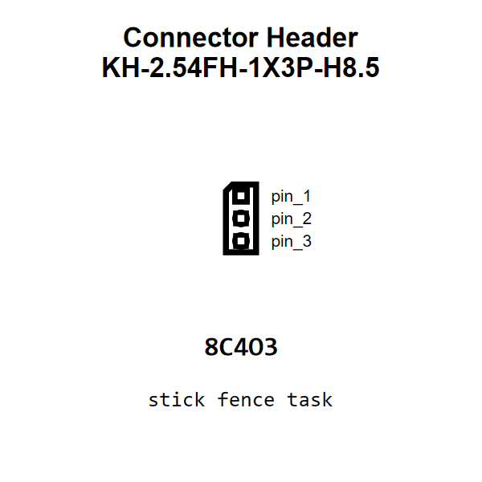

<!-- Generated item page. Full data lives in the source repository. -->
[Catalogue](../../../../../../../../../README.md) / [Electronic](../../../../../../../../README.md) / [Connector](../../../../../../../README.md) / [Header](../../../../../../README.md) / [2 54 Mm Pitch](../../../../../README.md) / [Through Hole](../../../../README.md) / [3 Pin](../../../README.md) / [Socket](../../README.md) / [Kinghelm](../README.md) / Kh 2 54fh 1x3p H8 5

# ⚡ Connector Header KH-2.54FH-1X3P-H8.5

> Connector Header KH-2.54FH-1X3P-H8.5 is an OOMP electronic connector definition. It uses the header package or form factor. Its nominal drawing size is 7.62 × 2.48 mm. The definition includes 3 documented pins.

[Full details →](https://github.com/oomlout/oomp_electronic_version_5/tree/main/parts/electronic_connector_header_2_54_mm_pitch_through_hole_3_pin_socket_kinghelm_kh_2_54fh_1x3p_h8_5)

## At a glance

| Detail | Value |
| --- | --- |
| Type | Connector |
| Package / style | header |
| Nominal size | 7.62 × 2.48 mm |
| Documented pins | 3 |
| OOMP ID | `electronic_connector_header_2_54_mm_pitch_through_hole_3_pin_socket_kinghelm_kh_2_54fh_1x3p_h8_5` |

## Catalogue location

`Electronic › Connector › Header › 2 54 Mm Pitch › Through Hole › 3 Pin › Socket › Kinghelm › Kh 2 54fh 1x3p H8 5`

## About this page

This is the compact catalogue view. A detailed source README is available. Schematics, fabrication data, working metadata, alternate diagrams, availability data, and project analysis stay with the [full original record](https://github.com/oomlout/oomp_electronic_version_5/tree/main/parts/electronic_connector_header_2_54_mm_pitch_through_hole_3_pin_socket_kinghelm_kh_2_54fh_1x3p_h8_5).

---

[↑ Parent category](../README.md) · [Catalogue home](../../../../../../../../../README.md)
