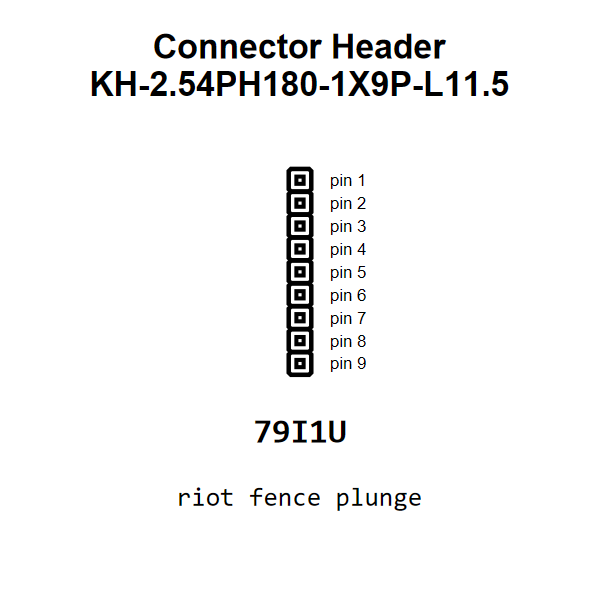

<!-- Generated item page. Full data lives in the source repository. -->
[Catalogue](../../../../../../README.md) / [Electronic](../../../../../README.md) / [Connector](../../../../README.md) / [Header](../../../README.md) / [2 54 Mm Pitch](../../README.md) / [Through Hole](../README.md) / 9 Pin

# ⚡ Connector Header KH-2.54PH180-1X9P-L11.5

> Connector Header KH-2.54PH180-1X9P-L11.5 is an OOMP electronic connector definition. It uses the header package or form factor. Its nominal drawing size is 22.86 × 2.48 mm.

[Full details →](https://github.com/oomlout/oomp_electronic_version_5/tree/main/parts/electronic_connector_header_2_54_mm_pitch_through_hole_9_pin)

## At a glance

| Detail | Value |
| --- | --- |
| Type | Connector |
| Package / style | header |
| Nominal size | 22.86 × 2.48 mm |
| OOMP ID | `electronic_connector_header_2_54_mm_pitch_through_hole_9_pin` |

## Catalogue location

`Electronic › Connector › Header › 2 54 Mm Pitch › Through Hole › 9 Pin`

## About this page

This is the compact catalogue view. A detailed source README is available. Schematics, fabrication data, working metadata, alternate diagrams, availability data, and project analysis stay with the [full original record](https://github.com/oomlout/oomp_electronic_version_5/tree/main/parts/electronic_connector_header_2_54_mm_pitch_through_hole_9_pin).

---

[↑ Parent category](../README.md) · [Catalogue home](../../../../../../README.md)
