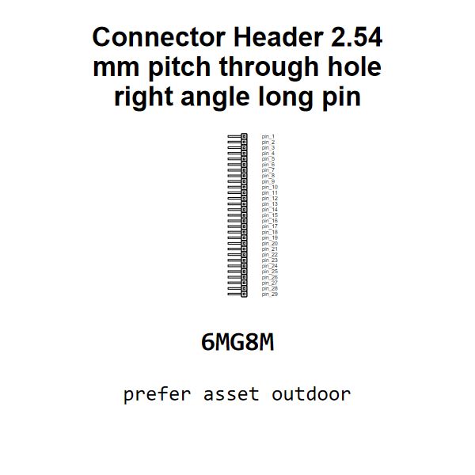

<!-- Generated item page. Full data lives in the source repository. -->
[Catalogue](../../../../../../README.md) / [Electronic](../../../../../README.md) / [Connector](../../../../README.md) / [Header](../../../README.md) / [2 54 Mm Pitch](../../README.md) / [Through Hole Right Angle Long Pin](../README.md) / 29 Pin

# ⚡ Connector Header 2.54 mm pitch through hole right angle long pin 29 pin

> Connector Header 2.54 mm pitch through hole right angle long pin 29 pin is an OOMP electronic connector definition. It uses the header package or form factor. Its nominal drawing size is 2.54 × 73.66 mm. The definition includes 29 documented pins.

[Full details →](https://github.com/oomlout/oomp_electronic_version_5/tree/main/parts/electronic_connector_header_2_54_mm_pitch_through_hole_right_angle_long_pin_29_pin)

## At a glance

| Detail | Value |
| --- | --- |
| Type | Connector |
| Package / style | header |
| Nominal size | 2.54 × 73.66 mm |
| Documented pins | 29 |
| OOMP ID | `electronic_connector_header_2_54_mm_pitch_through_hole_right_angle_long_pin_29_pin` |

## Catalogue location

`Electronic › Connector › Header › 2 54 Mm Pitch › Through Hole Right Angle Long Pin › 29 Pin`

## About this page

This is the compact catalogue view. A detailed source README is available. Schematics, fabrication data, working metadata, alternate diagrams, availability data, and project analysis stay with the [full original record](https://github.com/oomlout/oomp_electronic_version_5/tree/main/parts/electronic_connector_header_2_54_mm_pitch_through_hole_right_angle_long_pin_29_pin).

---

[↑ Parent category](../README.md) · [Catalogue home](../../../../../../README.md)
