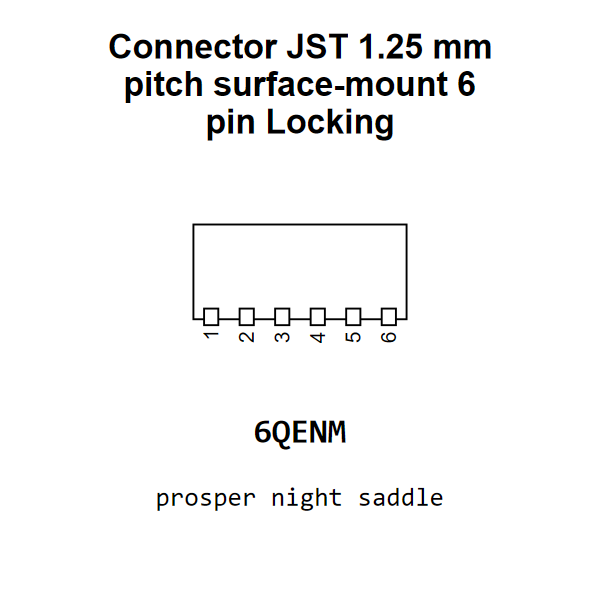

<!-- Generated item page. Full data lives in the source repository. -->
[Catalogue](../../../../../../../../README.md) / [Electronic](../../../../../../../README.md) / [Connector](../../../../../../README.md) / [JST](../../../../../README.md) / [1 25 Mm Pitch](../../../../README.md) / [Surface Mount](../../../README.md) / [6 Pin](../../README.md) / [Locking](../README.md) / JST Smd 1 25 Mm 6 Locking

# ⚡ Connector JST 1.25 mm pitch surface-mount 6 pin Locking

> Connector JST 1.25 mm pitch surface-mount 6 pin Locking is an OOMP electronic connector definition. It uses the jst package or form factor. Its nominal drawing size is 9.5 × 4.5 mm. The definition includes 6 documented pins.

[Full details →](https://github.com/oomlout/oomp_electronic_version_5/tree/main/parts/electronic_connector_jst_1_25_mm_pitch_surface_mount_6_pin_locking_jst_smd_1_25_mm_6_locking)

## At a glance

| Detail | Value |
| --- | --- |
| Type | Connector |
| Package / style | jst |
| Nominal size | 9.5 × 4.5 mm |
| Documented pins | 6 |
| OOMP ID | `electronic_connector_jst_1_25_mm_pitch_surface_mount_6_pin_locking_jst_smd_1_25_mm_6_locking` |

## Catalogue location

`Electronic › Connector › JST › 1 25 Mm Pitch › Surface Mount › 6 Pin › Locking › JST Smd 1 25 Mm 6 Locking`

## About this page

This is the compact catalogue view. A detailed source README is available. Schematics, fabrication data, working metadata, alternate diagrams, availability data, and project analysis stay with the [full original record](https://github.com/oomlout/oomp_electronic_version_5/tree/main/parts/electronic_connector_jst_1_25_mm_pitch_surface_mount_6_pin_locking_jst_smd_1_25_mm_6_locking).

---

[↑ Parent category](../README.md) · [Catalogue home](../../../../../../../../README.md)
