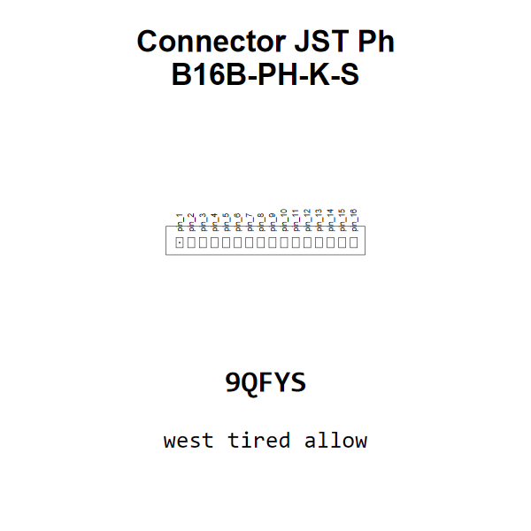

<!-- Generated item page. Full data lives in the source repository. -->
[Catalogue](../../../../../../../../README.md) / [Electronic](../../../../../../../README.md) / [Connector](../../../../../../README.md) / [JST Ph](../../../../../README.md) / [2 Mm Pitch](../../../../README.md) / [Through Hole Vertical](../../../README.md) / [16 Pin](../../README.md) / [JST](../README.md) / B16b Ph K S

# ⚡ Connector JST Ph B16B-PH-K-S

> Connector JST Ph B16B-PH-K-S is an OOMP electronic connector definition. It uses the jst ph package or form factor. Its nominal drawing size is 34.31 × 4.91 mm. The definition includes 16 documented pins.

[Full details →](https://github.com/oomlout/oomp_electronic_version_5/tree/main/parts/electronic_connector_jst_ph_2_mm_pitch_through_hole_vertical_16_pin_jst_b16b_ph_k_s)

## At a glance

| Detail | Value |
| --- | --- |
| Type | Connector |
| Package / style | jst ph |
| Nominal size | 34.31 × 4.91 mm |
| Documented pins | 16 |
| OOMP ID | `electronic_connector_jst_ph_2_mm_pitch_through_hole_vertical_16_pin_jst_b16b_ph_k_s` |

## Catalogue location

`Electronic › Connector › JST Ph › 2 Mm Pitch › Through Hole Vertical › 16 Pin › JST › B16b Ph K S`

## About this page

This is the compact catalogue view. A detailed source README is available. Schematics, fabrication data, working metadata, alternate diagrams, availability data, and project analysis stay with the [full original record](https://github.com/oomlout/oomp_electronic_version_5/tree/main/parts/electronic_connector_jst_ph_2_mm_pitch_through_hole_vertical_16_pin_jst_b16b_ph_k_s).

---

[↑ Parent category](../README.md) · [Catalogue home](../../../../../../../../README.md)
