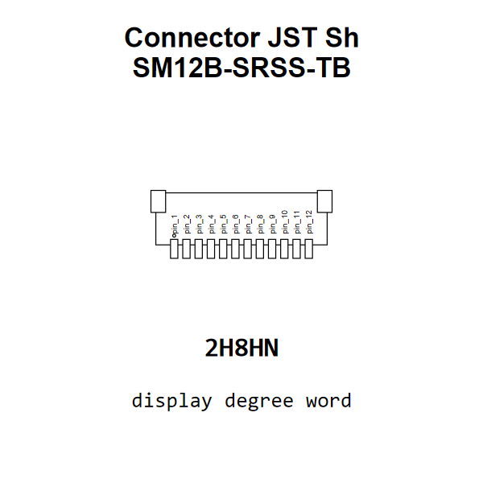

<!-- Generated item page. Full data lives in the source repository. -->
[Catalogue](../../../../../../../../README.md) / [Electronic](../../../../../../../README.md) / [Connector](../../../../../../README.md) / [JST Sh](../../../../../README.md) / [1 Mm Pitch](../../../../README.md) / [Surface Mount Right Angle](../../../README.md) / [12 Pin](../../README.md) / [JST](../README.md) / Sm12b Srss Tb

# ⚡ Connector JST Sh SM12B-SRSS-TB

> Connector JST Sh SM12B-SRSS-TB is an OOMP electronic connector definition. It uses the jst sh package or form factor. Its nominal drawing size is 14.0 × 4.25 mm. The definition includes 12 documented pins.

[Full details →](https://github.com/oomlout/oomp_electronic_version_5/tree/main/parts/electronic_connector_jst_sh_1_mm_pitch_surface_mount_right_angle_12_pin_jst_sm12b_srss_tb)

## At a glance

| Detail | Value |
| --- | --- |
| Type | Connector |
| Package / style | jst sh |
| Nominal size | 14.0 × 4.25 mm |
| Documented pins | 12 |
| OOMP ID | `electronic_connector_jst_sh_1_mm_pitch_surface_mount_right_angle_12_pin_jst_sm12b_srss_tb` |

## Catalogue location

`Electronic › Connector › JST Sh › 1 Mm Pitch › Surface Mount Right Angle › 12 Pin › JST › Sm12b Srss Tb`

## About this page

This is the compact catalogue view. A detailed source README is available. Schematics, fabrication data, working metadata, alternate diagrams, availability data, and project analysis stay with the [full original record](https://github.com/oomlout/oomp_electronic_version_5/tree/main/parts/electronic_connector_jst_sh_1_mm_pitch_surface_mount_right_angle_12_pin_jst_sm12b_srss_tb).

---

[↑ Parent category](../README.md) · [Catalogue home](../../../../../../../../README.md)
