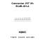

<!-- Generated item page. Full data lives in the source repository. -->
[Catalogue](../../../../../../../../README.md) / [Electronic](../../../../../../../README.md) / [Connector](../../../../../../README.md) / [JST Xh](../../../../../README.md) / [2 5 Mm Pitch](../../../../README.md) / [Through Hole](../../../README.md) / [14 Pin](../../README.md) / [JST](../README.md) / B14b Xh A

# ⚡ Connector JST Xh B14B-XH-A

> Connector JST Xh B14B-XH-A is an OOMP electronic connector definition. It uses the jst xh package or form factor. Its nominal drawing size is 37.4 × 5.75 mm. The definition includes 14 documented pins.

**[Full details →](https://github.com/oomlout/oomp_electronic_version_5/tree/main/parts/electronic_connector_jst_xh_2_5_mm_pitch_through_hole_14_pin_jst_b14b_xh_a)**

## At a glance

| Detail | Value |
| --- | --- |
| Type | Connector |
| Package / style | jst xh |
| Nominal size | 37.4 × 5.75 mm |
| Documented pins | 14 |
| OOMP ID | `electronic_connector_jst_xh_2_5_mm_pitch_through_hole_14_pin_jst_b14b_xh_a` |

## Catalogue location

`Electronic › Connector › JST Xh › 2 5 Mm Pitch › Through Hole › 14 Pin › JST › B14b Xh A`

## About this page

This is the compact catalogue view. A detailed source README is available. Schematics, fabrication data, working metadata, alternate diagrams, availability data, and project analysis stay with the [full original record](https://github.com/oomlout/oomp_electronic_version_5/tree/main/parts/electronic_connector_jst_xh_2_5_mm_pitch_through_hole_14_pin_jst_b14b_xh_a).

---

[↑ Parent category](../README.md) · [Catalogue home](../../../../../../../../README.md)
