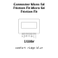

<!-- Generated item page. Full data lives in the source repository. -->
[Catalogue](../../../../../README.md) / [Electronic](../../../../README.md) / [Connector](../../../README.md) / [Micro Sd](../../README.md) / [Friction Fit](../README.md) / Micro Sd Friction Fit

# ⚡ Connector Micro Sd Friction Fit Micro Sd Friction Fit

> Connector Micro Sd Friction Fit Micro Sd Friction Fit is an OOMP electronic connector definition. It uses the micro sd package or form factor. Its nominal drawing size is 15.0 × 11.0 mm. The definition includes 10 documented pins.

**[Full details →](https://github.com/oomlout/oomp_electronic_version_5/tree/main/parts/electronic_connector_micro_sd_friction_fit_micro_sd_friction_fit)**

## At a glance

| Detail | Value |
| --- | --- |
| Type | Connector |
| Package / style | micro sd |
| Nominal size | 15.0 × 11.0 mm |
| Documented pins | 10 |
| OOMP ID | `electronic_connector_micro_sd_friction_fit_micro_sd_friction_fit` |

## Catalogue location

`Electronic › Connector › Micro Sd › Friction Fit › Micro Sd Friction Fit`

## About this page

This is the compact catalogue view. A detailed source README is available. Schematics, fabrication data, working metadata, alternate diagrams, availability data, and project analysis stay with the [full original record](https://github.com/oomlout/oomp_electronic_version_5/tree/main/parts/electronic_connector_micro_sd_friction_fit_micro_sd_friction_fit).

---

[↑ Parent category](../README.md) · [Catalogue home](../../../../../README.md)
