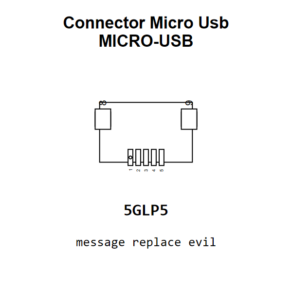

<!-- Generated item page. Full data lives in the source repository. -->
[Catalogue](../../../../../../../README.md) / [Electronic](../../../../../../README.md) / [Connector](../../../../../README.md) / [Micro USB](../../../../README.md) / [Surface Mount](../../../README.md) / [9 Pin](../../README.md) / [Rocketscream](../README.md) / Micro USB

# ⚡ Connector Micro Usb MICRO-USB

> Connector Micro Usb MICRO-USB is an OOMP electronic connector definition. It uses the micro usb package or form factor. Its nominal drawing size is 9.15 × 6.3 mm. The definition includes 9 documented pins.

[Full details →](https://github.com/oomlout/oomp_electronic_version_5/tree/main/parts/electronic_connector_micro_usb_surface_mount_9_pin_rocketscream_micro_usb)

## At a glance

| Detail | Value |
| --- | --- |
| Type | Connector |
| Package / style | micro usb |
| Nominal size | 9.15 × 6.3 mm |
| Documented pins | 9 |
| OOMP ID | `electronic_connector_micro_usb_surface_mount_9_pin_rocketscream_micro_usb` |

## Catalogue location

`Electronic › Connector › Micro USB › Surface Mount › 9 Pin › Rocketscream › Micro USB`

## About this page

This is the compact catalogue view. A detailed source README is available. Schematics, fabrication data, working metadata, alternate diagrams, availability data, and project analysis stay with the [full original record](https://github.com/oomlout/oomp_electronic_version_5/tree/main/parts/electronic_connector_micro_usb_surface_mount_9_pin_rocketscream_micro_usb).

---

[↑ Parent category](../README.md) · [Catalogue home](../../../../../../../README.md)
