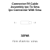

<!-- Generated item page. Full data lives in the source repository. -->
[Catalogue](../../../../../README.md) / [Electronic](../../../../README.md) / [Connector](../../../README.md) / [Rf Cable Assembly](../../README.md) / [Ipx To Sma](../README.md) / Ipx Connector With Sma

# ⚡ Connector Rf Cable Assembly Ipx To Sma Ipx Connector With Sma

> Connector Rf Cable Assembly Ipx To Sma Ipx Connector With Sma is an OOMP electronic connector definition. It uses the rf cable assembly package or form factor. Its nominal drawing size is 30.0 × 5.0 mm. The definition includes 2 documented pins.

**[Full details →](https://github.com/oomlout/oomp_electronic_version_5/tree/main/parts/electronic_connector_rf_cable_assembly_ipx_to_sma_ipx_connector_with_sma)**

## At a glance

| Detail | Value |
| --- | --- |
| Type | Connector |
| Package / style | rf cable assembly |
| Nominal size | 30.0 × 5.0 mm |
| Documented pins | 2 |
| OOMP ID | `electronic_connector_rf_cable_assembly_ipx_to_sma_ipx_connector_with_sma` |

## Catalogue location

`Electronic › Connector › Rf Cable Assembly › Ipx To Sma › Ipx Connector With Sma`

## About this page

This is the compact catalogue view. A detailed source README is available. Schematics, fabrication data, working metadata, alternate diagrams, availability data, and project analysis stay with the [full original record](https://github.com/oomlout/oomp_electronic_version_5/tree/main/parts/electronic_connector_rf_cable_assembly_ipx_to_sma_ipx_connector_with_sma).

---

[↑ Parent category](../README.md) · [Catalogue home](../../../../../README.md)
