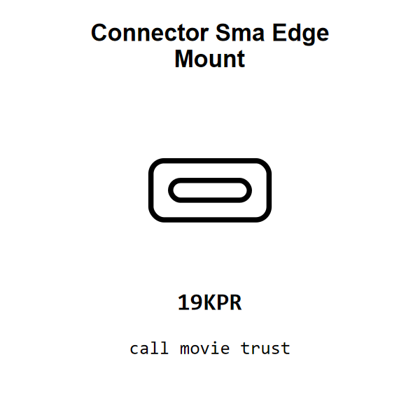

<!-- Generated item page. Full data lives in the source repository. -->
[Catalogue](../../../../README.md) / [Electronic](../../../README.md) / [Connector](../../README.md) / [Sma](../README.md) / Edge Mount

# ⚡ Connector Sma Edge Mount

> Connector Sma Edge Mount is an OOMP electronic connector definition. It uses the sma package or form factor. Its nominal drawing size is 10.0 × 5.0 mm.

[Full details →](https://github.com/oomlout/oomp_electronic_version_5/tree/main/parts/electronic_connector_sma_edge_mount)

## At a glance

| Detail | Value |
| --- | --- |
| Type | Connector |
| Package / style | sma |
| Nominal size | 10.0 × 5.0 mm |
| OOMP ID | `electronic_connector_sma_edge_mount` |

## Catalogue location

`Electronic › Connector › Sma › Edge Mount`

## About this page

This is the compact catalogue view. A detailed source README is available. Schematics, fabrication data, working metadata, alternate diagrams, availability data, and project analysis stay with the [full original record](https://github.com/oomlout/oomp_electronic_version_5/tree/main/parts/electronic_connector_sma_edge_mount).

---

[↑ Parent category](../README.md) · [Catalogue home](../../../../README.md)
