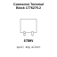

<!-- Generated item page. Full data lives in the source repository. -->
[Catalogue](../../../../../../../../README.md) / [Electronic](../../../../../../../README.md) / [Connector](../../../../../../README.md) / [Terminal Block](../../../../../README.md) / [3 5 Mm Pitch](../../../../README.md) / [Through Hole](../../../README.md) / [2 Pin](../../README.md) / [Te Connectivity](../README.md) / 1776275 2

# ⚡ Connector Terminal Block 1776275-2

> Connector Terminal Block 1776275-2 is an OOMP electronic connector definition. It uses the terminal block package or form factor. Its nominal drawing size is 10.0 × 5.0 mm.

**[Full details →](https://github.com/oomlout/oomp_electronic_version_5/tree/main/parts/electronic_connector_terminal_block_3_5_mm_pitch_through_hole_2_pin_te_connectivity_1776275_2)**

## At a glance

| Detail | Value |
| --- | --- |
| Type | Connector |
| Package / style | terminal block |
| Nominal size | 10.0 × 5.0 mm |
| OOMP ID | `electronic_connector_terminal_block_3_5_mm_pitch_through_hole_2_pin_te_connectivity_1776275_2` |

## Catalogue location

`Electronic › Connector › Terminal Block › 3 5 Mm Pitch › Through Hole › 2 Pin › Te Connectivity › 1776275 2`

## About this page

This is the compact catalogue view. A detailed source README is available. Schematics, fabrication data, working metadata, alternate diagrams, availability data, and project analysis stay with the [full original record](https://github.com/oomlout/oomp_electronic_version_5/tree/main/parts/electronic_connector_terminal_block_3_5_mm_pitch_through_hole_2_pin_te_connectivity_1776275_2).

---

[↑ Parent category](../README.md) · [Catalogue home](../../../../../../../../README.md)
