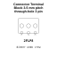

<!-- Generated item page. Full data lives in the source repository. -->
[Catalogue](../../../../../../../README.md) / [Electronic](../../../../../../README.md) / [Connector](../../../../../README.md) / [Terminal Block](../../../../README.md) / [3 5 Mm Pitch](../../../README.md) / [Through Hole](../../README.md) / [3 Pin](../README.md) / Screw Terminal 1x03 P3 5 Mm

# ⚡ Connector Terminal Block 3.5 mm pitch through-hole 3 pin Screw Terminal

> Connector Terminal Block 3.5 mm pitch through-hole 3 pin Screw Terminal 1X03 P3 5 Mm is an OOMP electronic connector definition. It uses the terminal block package or form factor. Its nominal drawing size is 11.0 × 8.0 mm. The definition includes 3 documented pins.

**[Full details →](https://github.com/oomlout/oomp_electronic_version_5/tree/main/parts/electronic_connector_terminal_block_3_5_mm_pitch_through_hole_3_pin_screw_terminal_1x03_p3_5_mm)**

## At a glance

| Detail | Value |
| --- | --- |
| Type | Connector |
| Package / style | terminal block |
| Nominal size | 11.0 × 8.0 mm |
| Documented pins | 3 |
| OOMP ID | `electronic_connector_terminal_block_3_5_mm_pitch_through_hole_3_pin_screw_terminal_1x03_p3_5_mm` |

## Catalogue location

`Electronic › Connector › Terminal Block › 3 5 Mm Pitch › Through Hole › 3 Pin › Screw Terminal 1x03 P3 5 Mm`

## About this page

This is the compact catalogue view. A detailed source README is available. Schematics, fabrication data, working metadata, alternate diagrams, availability data, and project analysis stay with the [full original record](https://github.com/oomlout/oomp_electronic_version_5/tree/main/parts/electronic_connector_terminal_block_3_5_mm_pitch_through_hole_3_pin_screw_terminal_1x03_p3_5_mm).

---

[↑ Parent category](../README.md) · [Catalogue home](../../../../../../../README.md)
