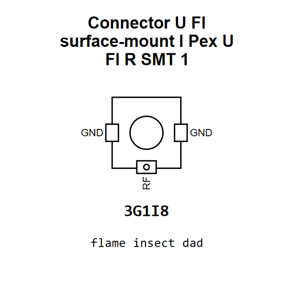

<!-- Generated item page. Full data lives in the source repository. -->
[Catalogue](../../../../../../README.md) / [Electronic](../../../../../README.md) / [Connector](../../../../README.md) / [U Fl](../../../README.md) / [Surface Mount](../../README.md) / [I Pex](../README.md) / U Fl R Smt 1

# ⚡ Connector U Fl surface-mount I Pex U Fl R SMT 1

> Connector U Fl surface-mount I Pex U Fl R SMT 1 is an OOMP electronic connector definition. It uses the u fl package or form factor. Its nominal drawing size is 3.0 × 3.1 mm. The definition includes 3 documented pins.

[Full details →](https://github.com/oomlout/oomp_electronic_version_5/tree/main/parts/electronic_connector_u_fl_surface_mount_i_pex_u_fl_r_smt_1)

## At a glance

| Detail | Value |
| --- | --- |
| Type | Connector |
| Package / style | u fl |
| Nominal size | 3.0 × 3.1 mm |
| Documented pins | 3 |
| OOMP ID | `electronic_connector_u_fl_surface_mount_i_pex_u_fl_r_smt_1` |

## Catalogue location

`Electronic › Connector › U Fl › Surface Mount › I Pex › U Fl R Smt 1`

## About this page

This is the compact catalogue view. A detailed source README is available. Schematics, fabrication data, working metadata, alternate diagrams, availability data, and project analysis stay with the [full original record](https://github.com/oomlout/oomp_electronic_version_5/tree/main/parts/electronic_connector_u_fl_surface_mount_i_pex_u_fl_r_smt_1).

---

[↑ Parent category](../README.md) · [Catalogue home](../../../../../../README.md)
