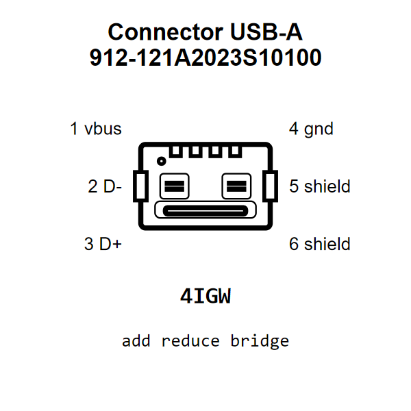

<!-- Generated item page. Full data lives in the source repository. -->
[Catalogue](../../../../../../../README.md) / [Electronic](../../../../../../README.md) / [Connector](../../../../../README.md) / [USB A](../../../../README.md) / [Surface Mount](../../../README.md) / [4 Pin](../../README.md) / [Shenzhen Jing Tuo Jin Electronics](../README.md) / 912121a2023s10100

# ⚡ Connector USB-A 912-121A2023S10100

> Connector USB-A 912-121A2023S10100 is an OOMP electronic connector definition. It uses the usb a package or form factor. Its nominal drawing size is 14.3 × 10.6 mm. The definition includes 6 documented pins.

[Full details →](https://github.com/oomlout/oomp_electronic_version_5/tree/main/parts/electronic_connector_usb_a_surface_mount_4_pin_shenzhen_jing_tuo_jin_electronics_912121a2023s10100)

## At a glance

| Detail | Value |
| --- | --- |
| Type | Connector |
| Package / style | usb a |
| Nominal size | 14.3 × 10.6 mm |
| Documented pins | 6 |
| OOMP ID | `electronic_connector_usb_a_surface_mount_4_pin_shenzhen_jing_tuo_jin_electronics_912121a2023s10100` |

## Catalogue location

`Electronic › Connector › USB A › Surface Mount › 4 Pin › Shenzhen Jing Tuo Jin Electronics › 912121a2023s10100`

## About this page

This is the compact catalogue view. A detailed source README is available. Schematics, fabrication data, working metadata, alternate diagrams, availability data, and project analysis stay with the [full original record](https://github.com/oomlout/oomp_electronic_version_5/tree/main/parts/electronic_connector_usb_a_surface_mount_4_pin_shenzhen_jing_tuo_jin_electronics_912121a2023s10100).

---

[↑ Parent category](../README.md) · [Catalogue home](../../../../../../../README.md)
