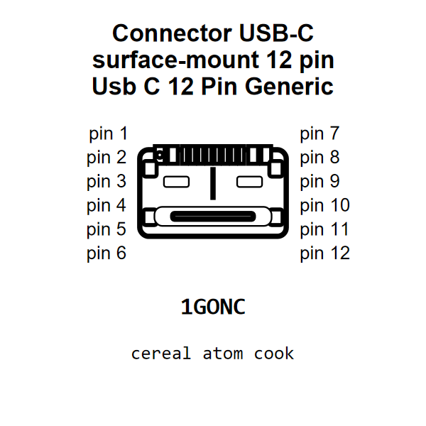

<!-- Generated item page. Full data lives in the source repository. -->
[Catalogue](../../../../../../README.md) / [Electronic](../../../../../README.md) / [Connector](../../../../README.md) / [USB C](../../../README.md) / [Surface Mount](../../README.md) / [12 Pin](../README.md) / USB C 12 Pin Generic

# ⚡ Connector USB-C surface-mount 12 pin Usb C 12 Pin Generic

> Connector USB-C surface-mount 12 pin Usb C 12 Pin Generic is an OOMP electronic connector definition. It uses the usb c package or form factor. Its nominal drawing size is 8.94 × 7.35 mm.

[Full details →](https://github.com/oomlout/oomp_electronic_version_5/tree/main/parts/electronic_connector_usb_c_surface_mount_12_pin_usb_c_12_pin_generic)

## At a glance

| Detail | Value |
| --- | --- |
| Type | Connector |
| Package / style | usb c |
| Nominal size | 8.94 × 7.35 mm |
| OOMP ID | `electronic_connector_usb_c_surface_mount_12_pin_usb_c_12_pin_generic` |

## Catalogue location

`Electronic › Connector › USB C › Surface Mount › 12 Pin › USB C 12 Pin Generic`

## About this page

This is the compact catalogue view. A detailed source README is available. Schematics, fabrication data, working metadata, alternate diagrams, availability data, and project analysis stay with the [full original record](https://github.com/oomlout/oomp_electronic_version_5/tree/main/parts/electronic_connector_usb_c_surface_mount_12_pin_usb_c_12_pin_generic).

---

[↑ Parent category](../README.md) · [Catalogue home](../../../../../../README.md)
