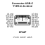

<!-- Generated item page. Full data lives in the source repository. -->
[Catalogue](../../../../../../../README.md) / [Electronic](../../../../../../README.md) / [Connector](../../../../../README.md) / [USB C](../../../../README.md) / [Surface Mount](../../../README.md) / [16 Pin](../../README.md) / [Korean Hroparts Elec](../README.md) / Typec31m12

# ⚡ Connector USB-C TYPE-C-31-M-12

> Connector USB-C TYPE-C-31-M-12 is an OOMP electronic connector definition. It uses the usb c package or form factor. Its nominal drawing size is 8.94 × 7.35 mm. The definition includes 16 documented pins.

**[Full details →](https://github.com/oomlout/oomp_electronic_version_5/tree/main/parts/electronic_connector_usb_c_surface_mount_16_pin_korean_hroparts_elec_typec31m12)**

## At a glance

| Detail | Value |
| --- | --- |
| Type | Connector |
| Package / style | usb c |
| Nominal size | 8.94 × 7.35 mm |
| Documented pins | 16 |
| OOMP ID | `electronic_connector_usb_c_surface_mount_16_pin_korean_hroparts_elec_typec31m12` |

## Catalogue location

`Electronic › Connector › USB C › Surface Mount › 16 Pin › Korean Hroparts Elec › Typec31m12`

## About this page

This is the compact catalogue view. A detailed source README is available. Schematics, fabrication data, working metadata, alternate diagrams, availability data, and project analysis stay with the [full original record](https://github.com/oomlout/oomp_electronic_version_5/tree/main/parts/electronic_connector_usb_c_surface_mount_16_pin_korean_hroparts_elec_typec31m12).

---

[↑ Parent category](../README.md) · [Catalogue home](../../../../../../../README.md)
