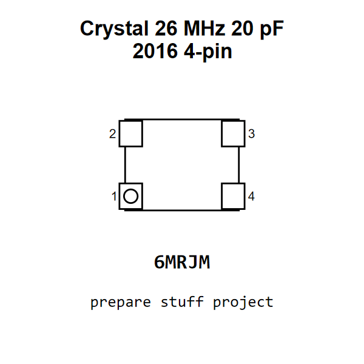

<!-- Generated item page. Full data lives in the source repository. -->
[Catalogue](../../../../../../../../../README.md) / [Electronic](../../../../../../../../README.md) / [Crystal](../../../../../../../README.md) / [2016](../../../../../../README.md) / [Surface Mount](../../../../../README.md) / [4 Pin](../../../../README.md) / [26 Mhz](../../../README.md) / [20 Pf](../../README.md) / [Txc](../README.md) / Nx3225gd

# ⚡ Crystal 26 MHz 20 pF 2016 4-pin

> Crystal 26 MHz 20 pF 2016 4-pin is an OOMP electronic crystal definition. It uses the 2016 package or form factor. Its nominal drawing size is 2.0 × 1.6 mm. The definition includes 4 documented pins.

[Full details →](https://github.com/oomlout/oomp_electronic_version_5/tree/main/parts/electronic_crystal_2016_surface_mount_4_pin_26_mhz_20_pf_txc_nx3225gd)

## At a glance

| Detail | Value |
| --- | --- |
| Type | Crystal |
| Package / style | 2016 |
| Nominal size | 2.0 × 1.6 mm |
| Documented pins | 4 |
| OOMP ID | `electronic_crystal_2016_surface_mount_4_pin_26_mhz_20_pf_txc_nx3225gd` |

## Catalogue location

`Electronic › Crystal › 2016 › Surface Mount › 4 Pin › 26 Mhz › 20 Pf › Txc › Nx3225gd`

## About this page

This is the compact catalogue view. A detailed source README is available. Schematics, fabrication data, working metadata, alternate diagrams, availability data, and project analysis stay with the [full original record](https://github.com/oomlout/oomp_electronic_version_5/tree/main/parts/electronic_crystal_2016_surface_mount_4_pin_26_mhz_20_pf_txc_nx3225gd).

---

[↑ Parent category](../README.md) · [Catalogue home](../../../../../../../../../README.md)
