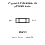

<!-- Generated item page. Full data lives in the source repository. -->
[Catalogue](../../../../../../../README.md) / [Electronic](../../../../../../README.md) / [Crystal](../../../../../README.md) / [3225](../../../../README.md) / [Surface Mount](../../../README.md) / [4 Pin](../../README.md) / [3 579545 Mhz](../README.md) / 20 Pf

# ⚡ Crystal 3.57954 MHz 20 pF 3225 4-pin

> Crystal 3.57954 MHz 20 pF 3225 4-pin is an OOMP electronic crystal definition. It uses the 3225 package or form factor. Its nominal drawing size is 3.2 × 2.5 mm.

**[Full details →](https://github.com/oomlout/oomp_electronic_version_5/tree/main/parts/electronic_crystal_3225_surface_mount_4_pin_3_579545_mhz_20_pf)**

## At a glance

| Detail | Value |
| --- | --- |
| Type | Crystal |
| Package / style | 3225 |
| Nominal size | 3.2 × 2.5 mm |
| OOMP ID | `electronic_crystal_3225_surface_mount_4_pin_3_579545_mhz_20_pf` |

## Catalogue location

`Electronic › Crystal › 3225 › Surface Mount › 4 Pin › 3 579545 Mhz › 20 Pf`

## About this page

This is the compact catalogue view. A detailed source README is available. Schematics, fabrication data, working metadata, alternate diagrams, availability data, and project analysis stay with the [full original record](https://github.com/oomlout/oomp_electronic_version_5/tree/main/parts/electronic_crystal_3225_surface_mount_4_pin_3_579545_mhz_20_pf).

---

[↑ Parent category](../README.md) · [Catalogue home](../../../../../../../README.md)
