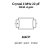

<!-- Generated item page. Full data lives in the source repository. -->
[Catalogue](../../../../../../../README.md) / [Electronic](../../../../../../README.md) / [Crystal](../../../../../README.md) / [5032](../../../../README.md) / [Surface Mount](../../../README.md) / [2 Pin](../../README.md) / [8 Mhz](../README.md) / 20 Pf

# ⚡ Crystal 8 MHz 20 pF 5032 2-pin

> Crystal 8 MHz 20 pF 5032 2-pin is an OOMP electronic crystal definition. It uses the 5032 package or form factor. Its nominal drawing size is 5.0 × 3.2 mm. The definition includes 2 documented pins.

**[Full details →](https://github.com/oomlout/oomp_electronic_version_5/tree/main/parts/electronic_crystal_5032_surface_mount_2_pin_8_mhz_20_pf)**

## At a glance

| Detail | Value |
| --- | --- |
| Type | Crystal |
| Package / style | 5032 |
| Nominal size | 5.0 × 3.2 mm |
| Documented pins | 2 |
| OOMP ID | `electronic_crystal_5032_surface_mount_2_pin_8_mhz_20_pf` |

## Catalogue location

`Electronic › Crystal › 5032 › Surface Mount › 2 Pin › 8 Mhz › 20 Pf`

## About this page

This is the compact catalogue view. A detailed source README is available. Schematics, fabrication data, working metadata, alternate diagrams, availability data, and project analysis stay with the [full original record](https://github.com/oomlout/oomp_electronic_version_5/tree/main/parts/electronic_crystal_5032_surface_mount_2_pin_8_mhz_20_pf).

---

[↑ Parent category](../README.md) · [Catalogue home](../../../../../../../README.md)
