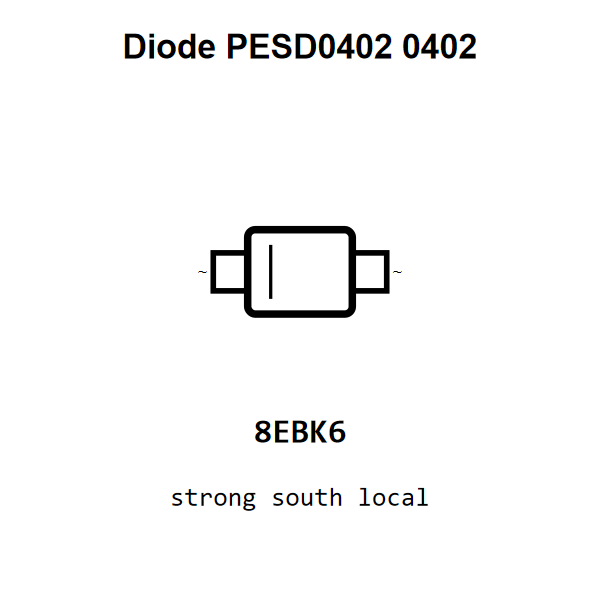

<!-- Generated item page. Full data lives in the source repository. -->
[Catalogue](../../../../../../README.md) / [Electronic](../../../../../README.md) / [Diode](../../../../README.md) / [Esd](../../../README.md) / [0402](../../README.md) / [Littelfuse](../README.md) / Pesd0402

# ⚡ Diode PESD0402 0402

> Diode PESD0402 0402 is an OOMP electronic diode definition. It uses the 0402 package or form factor. Its nominal drawing size is 1.0 × 0.5 mm. The definition includes 2 documented pins.

[Full details →](https://github.com/oomlout/oomp_electronic_version_5/tree/main/parts/electronic_diode_esd_0402_littelfuse_pesd0402)

## At a glance

| Detail | Value |
| --- | --- |
| Type | Diode |
| Package / style | 0402 |
| Nominal size | 1.0 × 0.5 mm |
| Documented pins | 2 |
| OOMP ID | `electronic_diode_esd_0402_littelfuse_pesd0402` |

## Catalogue location

`Electronic › Diode › Esd › 0402 › Littelfuse › Pesd0402`

## About this page

This is the compact catalogue view. A detailed source README is available. Schematics, fabrication data, working metadata, alternate diagrams, availability data, and project analysis stay with the [full original record](https://github.com/oomlout/oomp_electronic_version_5/tree/main/parts/electronic_diode_esd_0402_littelfuse_pesd0402).

---

[↑ Parent category](../README.md) · [Catalogue home](../../../../../../README.md)
