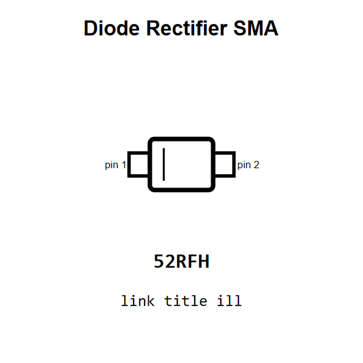

<!-- Generated item page. Full data lives in the source repository. -->
[Catalogue](../../../../../README.md) / [Electronic](../../../../README.md) / [Diode](../../../README.md) / [Rectifier](../../README.md) / [Sma](../README.md) / M4

# ⚡ Diode Rectifier SMA

> Diode Rectifier SMA is an OOMP electronic diode definition. It uses the sma package or form factor. Its nominal drawing size is 10.0 × 5.0 mm.

[Full details →](https://github.com/oomlout/oomp_electronic_version_5/tree/main/parts/electronic_diode_rectifier_sma_m4)

## At a glance

| Detail | Value |
| --- | --- |
| Type | Diode |
| Package / style | sma |
| Nominal size | 10.0 × 5.0 mm |
| OOMP ID | `electronic_diode_rectifier_sma_m4` |

## Catalogue location

`Electronic › Diode › Rectifier › Sma › M4`

## About this page

This is the compact catalogue view. A detailed source README is available. Schematics, fabrication data, working metadata, alternate diagrams, availability data, and project analysis stay with the [full original record](https://github.com/oomlout/oomp_electronic_version_5/tree/main/parts/electronic_diode_rectifier_sma_m4).

---

[↑ Parent category](../README.md) · [Catalogue home](../../../../../README.md)
