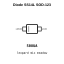

<!-- Generated item page. Full data lives in the source repository. -->
[Catalogue](../../../../../README.md) / [Electronic](../../../../README.md) / [Diode](../../../README.md) / [Schottky](../../README.md) / [Sod 123](../README.md) / Ss14

# ⚡ Diode SS14L SOD-123

> Diode SS14L SOD-123 is an OOMP electronic diode definition. It uses the sod 123 package or form factor. Its nominal drawing size is 3.5 × 1.6 mm. The definition includes 2 documented pins.

**[Full details →](https://github.com/oomlout/oomp_electronic_version_5/tree/main/parts/electronic_diode_schottky_sod_123_ss14)**

## At a glance

| Detail | Value |
| --- | --- |
| Type | Diode |
| Package / style | sod 123 |
| Nominal size | 3.5 × 1.6 mm |
| Documented pins | 2 |
| OOMP ID | `electronic_diode_schottky_sod_123_ss14` |

## Catalogue location

`Electronic › Diode › Schottky › Sod 123 › Ss14`

## About this page

This is the compact catalogue view. A detailed source README is available. Schematics, fabrication data, working metadata, alternate diagrams, availability data, and project analysis stay with the [full original record](https://github.com/oomlout/oomp_electronic_version_5/tree/main/parts/electronic_diode_schottky_sod_123_ss14).

---

[↑ Parent category](../README.md) · [Catalogue home](../../../../../README.md)
