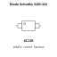

<!-- Generated item page. Full data lives in the source repository. -->
[Catalogue](../../../../../../README.md) / [Electronic](../../../../../README.md) / [Diode](../../../../README.md) / [Schottky](../../../README.md) / [Sod 323](../../README.md) / [Infineon](../README.md) / Bat20j

# ⚡ Diode Schottky SOD-323

> Diode Schottky SOD-323 is an OOMP electronic diode definition. It uses the sod 323 package or form factor. Its nominal drawing size is 1.7 × 1.25 mm. The definition includes 2 documented pins.

**[Full details →](https://github.com/oomlout/oomp_electronic_version_5/tree/main/parts/electronic_diode_schottky_sod_323_infineon_bat20j)**

## At a glance

| Detail | Value |
| --- | --- |
| Type | Diode |
| Package / style | sod 323 |
| Nominal size | 1.7 × 1.25 mm |
| Documented pins | 2 |
| OOMP ID | `electronic_diode_schottky_sod_323_infineon_bat20j` |

## Catalogue location

`Electronic › Diode › Schottky › Sod 323 › Infineon › Bat20j`

## About this page

This is the compact catalogue view. A detailed source README is available. Schematics, fabrication data, working metadata, alternate diagrams, availability data, and project analysis stay with the [full original record](https://github.com/oomlout/oomp_electronic_version_5/tree/main/parts/electronic_diode_schottky_sod_323_infineon_bat20j).

---

[↑ Parent category](../README.md) · [Catalogue home](../../../../../../README.md)
