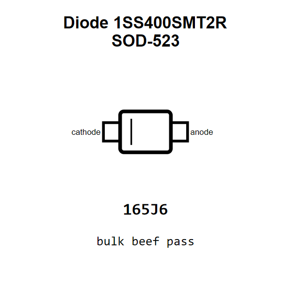

<!-- Generated item page. Full data lives in the source repository. -->
[Catalogue](../../../../../README.md) / [Electronic](../../../../README.md) / [Diode](../../../README.md) / [Schottky](../../README.md) / [Sod 523](../README.md) / 1ss400

# ⚡ Diode 1SS400SMT2R SOD-523

> Diode 1SS400SMT2R SOD-523 is an OOMP electronic diode definition. It uses the sod 523 package or form factor. Its nominal drawing size is 1.6 × 0.8 mm. The definition includes 2 documented pins.

[Full details →](https://github.com/oomlout/oomp_electronic_version_5/tree/main/parts/electronic_diode_schottky_sod_523_1ss400)

## At a glance

| Detail | Value |
| --- | --- |
| Type | Diode |
| Package / style | sod 523 |
| Nominal size | 1.6 × 0.8 mm |
| Documented pins | 2 |
| OOMP ID | `electronic_diode_schottky_sod_523_1ss400` |

## Catalogue location

`Electronic › Diode › Schottky › Sod 523 › 1ss400`

## About this page

This is the compact catalogue view. A detailed source README is available. Schematics, fabrication data, working metadata, alternate diagrams, availability data, and project analysis stay with the [full original record](https://github.com/oomlout/oomp_electronic_version_5/tree/main/parts/electronic_diode_schottky_sod_523_1ss400).

---

[↑ Parent category](../README.md) · [Catalogue home](../../../../../README.md)
