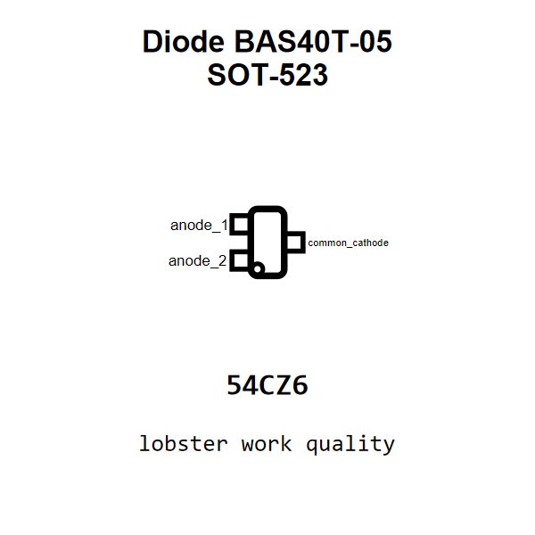

<!-- Generated item page. Full data lives in the source repository. -->
[Catalogue](../../../../../../README.md) / [Electronic](../../../../../README.md) / [Diode](../../../../README.md) / [Schottky Dual Common Cathode](../../../README.md) / [Sot 523](../../README.md) / [Diodes Incorporated](../README.md) / Bas40t 05

# ⚡ Diode BAS40T-05 SOT-523

> Diode BAS40T-05 SOT-523 is an OOMP electronic diode definition. It uses the sot 523 package or form factor. Its nominal drawing size is 1.6 × 0.8 mm. The definition includes 3 documented pins.

[Full details →](https://github.com/oomlout/oomp_electronic_version_5/tree/main/parts/electronic_diode_schottky_dual_common_cathode_sot_523_diodes_incorporated_bas40t_05)

## At a glance

| Detail | Value |
| --- | --- |
| Type | Diode |
| Package / style | sot 523 |
| Nominal size | 1.6 × 0.8 mm |
| Documented pins | 3 |
| OOMP ID | `electronic_diode_schottky_dual_common_cathode_sot_523_diodes_incorporated_bas40t_05` |

## Catalogue location

`Electronic › Diode › Schottky Dual Common Cathode › Sot 523 › Diodes Incorporated › Bas40t 05`

## About this page

This is the compact catalogue view. A detailed source README is available. Schematics, fabrication data, working metadata, alternate diagrams, availability data, and project analysis stay with the [full original record](https://github.com/oomlout/oomp_electronic_version_5/tree/main/parts/electronic_diode_schottky_dual_common_cathode_sot_523_diodes_incorporated_bas40t_05).

---

[↑ Parent category](../README.md) · [Catalogue home](../../../../../../README.md)
