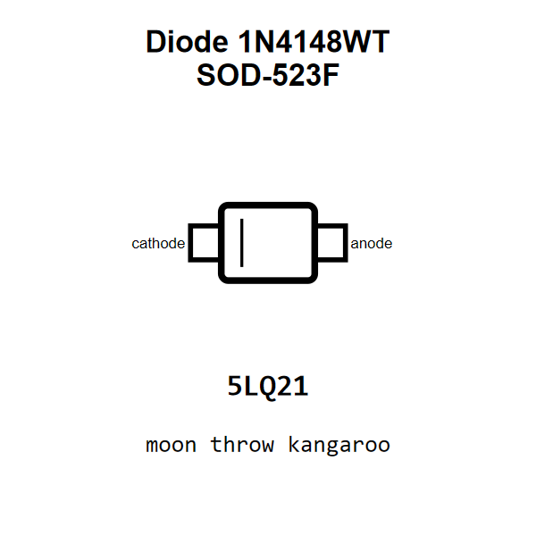

<!-- Generated item page. Full data lives in the source repository. -->
[Catalogue](../../../../../../README.md) / [Electronic](../../../../../README.md) / [Diode](../../../../README.md) / [Switching](../../../README.md) / [Sod 523f](../../README.md) / [Onsemi](../README.md) / 1n4148wt

# ⚡ Diode 1N4148WT SOD-523F

> Diode 1N4148WT SOD-523F is an OOMP electronic diode definition. It uses the sod 523f package or form factor. Its nominal drawing size is 1.6 × 0.8 mm. The definition includes 2 documented pins.

[Full details →](https://github.com/oomlout/oomp_electronic_version_5/tree/main/parts/electronic_diode_switching_sod_523f_onsemi_1n4148wt)

## At a glance

| Detail | Value |
| --- | --- |
| Type | Diode |
| Package / style | sod 523f |
| Nominal size | 1.6 × 0.8 mm |
| Documented pins | 2 |
| OOMP ID | `electronic_diode_switching_sod_523f_onsemi_1n4148wt` |

## Catalogue location

`Electronic › Diode › Switching › Sod 523f › Onsemi › 1n4148wt`

## About this page

This is the compact catalogue view. A detailed source README is available. Schematics, fabrication data, working metadata, alternate diagrams, availability data, and project analysis stay with the [full original record](https://github.com/oomlout/oomp_electronic_version_5/tree/main/parts/electronic_diode_switching_sod_523f_onsemi_1n4148wt).

---

[↑ Parent category](../README.md) · [Catalogue home](../../../../../../README.md)
