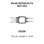

<!-- Generated item page. Full data lives in the source repository. -->
[Catalogue](../../../../../../README.md) / [Electronic](../../../../../README.md) / [Diode](../../../../README.md) / [Tvs](../../../README.md) / [Sot 353](../../README.md) / [Toshiba](../README.md) / Df5a5 6lfu

# ⚡ Diode DF5A5.6LFU SOT-353

> Diode DF5A5.6LFU SOT-353 is an OOMP electronic diode definition. It uses the sot 353 package or form factor. Its nominal drawing size is 2.0 × 1.25 mm. The definition includes 5 documented pins.

**[Full details →](https://github.com/oomlout/oomp_electronic_version_5/tree/main/parts/electronic_diode_tvs_sot_353_toshiba_df5a5_6lfu)**

## At a glance

| Detail | Value |
| --- | --- |
| Type | Diode |
| Package / style | sot 353 |
| Nominal size | 2.0 × 1.25 mm |
| Documented pins | 5 |
| OOMP ID | `electronic_diode_tvs_sot_353_toshiba_df5a5_6lfu` |

## Catalogue location

`Electronic › Diode › Tvs › Sot 353 › Toshiba › Df5a5 6lfu`

## About this page

This is the compact catalogue view. A detailed source README is available. Schematics, fabrication data, working metadata, alternate diagrams, availability data, and project analysis stay with the [full original record](https://github.com/oomlout/oomp_electronic_version_5/tree/main/parts/electronic_diode_tvs_sot_353_toshiba_df5a5_6lfu).

---

[↑ Parent category](../README.md) · [Catalogue home](../../../../../../README.md)
