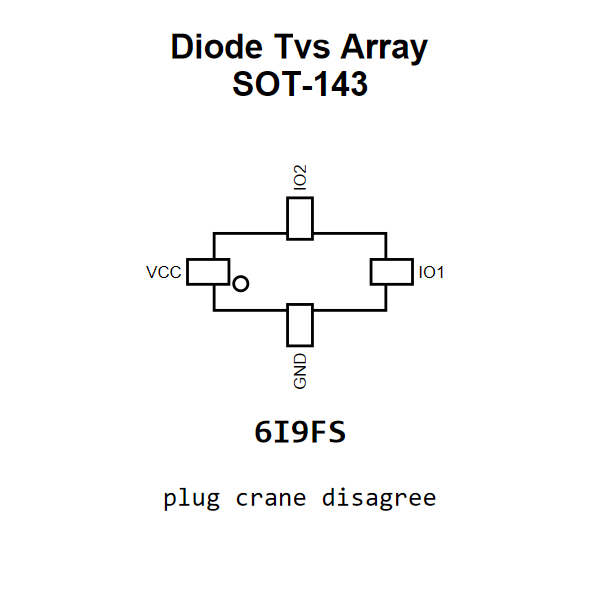

<!-- Generated item page. Full data lives in the source repository. -->
[Catalogue](../../../../../../README.md) / [Electronic](../../../../../README.md) / [Diode](../../../../README.md) / [Tvs Array](../../../README.md) / [Sot 143](../../README.md) / [Nxp](../README.md) / Prtr5v0u2x

# ⚡ Diode Tvs Array SOT-143

> Diode Tvs Array SOT-143 is an OOMP electronic diode definition. It uses the sot 143 package or form factor. Its nominal drawing size is 3.0 × 1.3 mm. The definition includes 4 documented pins.

[Full details →](https://github.com/oomlout/oomp_electronic_version_5/tree/main/parts/electronic_diode_tvs_array_sot_143_nxp_prtr5v0u2x)

## At a glance

| Detail | Value |
| --- | --- |
| Type | Diode |
| Package / style | sot 143 |
| Nominal size | 3.0 × 1.3 mm |
| Documented pins | 4 |
| OOMP ID | `electronic_diode_tvs_array_sot_143_nxp_prtr5v0u2x` |

## Catalogue location

`Electronic › Diode › Tvs Array › Sot 143 › Nxp › Prtr5v0u2x`

## About this page

This is the compact catalogue view. A detailed source README is available. Schematics, fabrication data, working metadata, alternate diagrams, availability data, and project analysis stay with the [full original record](https://github.com/oomlout/oomp_electronic_version_5/tree/main/parts/electronic_diode_tvs_array_sot_143_nxp_prtr5v0u2x).

---

[↑ Parent category](../README.md) · [Catalogue home](../../../../../../README.md)
