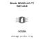

<!-- Generated item page. Full data lives in the source repository. -->
[Catalogue](../../../../../../README.md) / [Electronic](../../../../../README.md) / [Diode](../../../../README.md) / [Tvs Array](../../../README.md) / [Sot 23 6](../../README.md) / [Protek](../README.md) / Srv054pt7

# ⚡ Diode SRV05-4-P-T7 SOT-23-6

> Diode SRV05-4-P-T7 SOT-23-6 is an OOMP electronic diode definition. It uses the sot 23 6 package or form factor. Its nominal drawing size is 2.9 × 1.6 mm.

**[Full details →](https://github.com/oomlout/oomp_electronic_version_5/tree/main/parts/electronic_diode_tvs_array_sot_23_6_protek_srv054pt7)**

## At a glance

| Detail | Value |
| --- | --- |
| Type | Diode |
| Package / style | sot 23 6 |
| Nominal size | 2.9 × 1.6 mm |
| OOMP ID | `electronic_diode_tvs_array_sot_23_6_protek_srv054pt7` |

## Catalogue location

`Electronic › Diode › Tvs Array › Sot 23 6 › Protek › Srv054pt7`

## About this page

This is the compact catalogue view. A detailed source README is available. Schematics, fabrication data, working metadata, alternate diagrams, availability data, and project analysis stay with the [full original record](https://github.com/oomlout/oomp_electronic_version_5/tree/main/parts/electronic_diode_tvs_array_sot_23_6_protek_srv054pt7).

---

[↑ Parent category](../README.md) · [Catalogue home](../../../../../../README.md)
