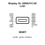

<!-- Generated item page. Full data lives in the source repository. -->
[Catalogue](../../../../../../README.md) / [Electronic](../../../../../README.md) / [Display](../../../../README.md) / [Lcd](../../../README.md) / [Character](../../README.md) / [16 By 2](../README.md) / Backlight Yellow

# ⚡ Display XL-1608UYC-06 LCD

> Display XL-1608UYC-06 LCD is an OOMP electronic display definition. It uses the lcd package or form factor. Its nominal drawing size is 80.0 × 36.0 mm. The definition includes 16 documented pins.

**[Full details →](https://github.com/oomlout/oomp_electronic_version_5/tree/main/parts/electronic_display_lcd_character_16_by_2_backlight_yellow)**

## At a glance

| Detail | Value |
| --- | --- |
| Type | Display |
| Package / style | lcd |
| Nominal size | 80.0 × 36.0 mm |
| Documented pins | 16 |
| OOMP ID | `electronic_display_lcd_character_16_by_2_backlight_yellow` |

## Catalogue location

`Electronic › Display › Lcd › Character › 16 By 2 › Backlight Yellow`

## About this page

This is the compact catalogue view. A detailed source README is available. Schematics, fabrication data, working metadata, alternate diagrams, availability data, and project analysis stay with the [full original record](https://github.com/oomlout/oomp_electronic_version_5/tree/main/parts/electronic_display_lcd_character_16_by_2_backlight_yellow).

---

[↑ Parent category](../README.md) · [Catalogue home](../../../../../../README.md)
