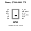

<!-- Generated item page. Full data lives in the source repository. -->
[Catalogue](../../../../../../../../../../README.md) / [Electronic](../../../../../../../../../README.md) / [Display](../../../../../../../../README.md) / [Tft](../../../../../../../README.md) / [2 Inch](../../../../../../README.md) / [240 X 320 Pixel](../../../../../README.md) / [Ips](../../../../README.md) / [Spi](../../../README.md) / [12 Pin](../../README.md) / [Szhtc](../README.md) / Qt200h1201

# ⚡ Display QT200H1201 TFT

> Display QT200H1201 TFT is an OOMP electronic display definition. It uses the tft package or form factor. Its nominal drawing size is 34.6 × 47.8 mm. The definition includes 12 documented pins.

**[Full details →](https://github.com/oomlout/oomp_electronic_version_5/tree/main/parts/electronic_display_tft_2_inch_240_x_320_pixel_ips_spi_12_pin_szhtc_qt200h1201)**

## At a glance

| Detail | Value |
| --- | --- |
| Type | Display |
| Package / style | tft |
| Nominal size | 34.6 × 47.8 mm |
| Documented pins | 12 |
| OOMP ID | `electronic_display_tft_2_inch_240_x_320_pixel_ips_spi_12_pin_szhtc_qt200h1201` |

## Catalogue location

`Electronic › Display › Tft › 2 Inch › 240 X 320 Pixel › Ips › Spi › 12 Pin › Szhtc › Qt200h1201`

## About this page

This is the compact catalogue view. A detailed source README is available. Schematics, fabrication data, working metadata, alternate diagrams, availability data, and project analysis stay with the [full original record](https://github.com/oomlout/oomp_electronic_version_5/tree/main/parts/electronic_display_tft_2_inch_240_x_320_pixel_ips_spi_12_pin_szhtc_qt200h1201).

---

[↑ Parent category](../README.md) · [Catalogue home](../../../../../../../../../../README.md)
