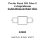

<!-- Generated item page. Full data lives in the source repository. -->
[Catalogue](../../../../../../../README.md) / [Electronic](../../../../../../README.md) / [Ferrite Bead](../../../../../README.md) / [0603](../../../../README.md) / [220 Ohm](../../../README.md) / [2 2 Amp](../../README.md) / [Murata](../README.md) / Blm18kg221sn1d

# ⚡ Ferrite Bead 220 Ohm 2 2 Amp Murata BLM18KG221SN1D 0603

> Ferrite Bead 220 Ohm 2 2 Amp Murata BLM18KG221SN1D 0603 is an OOMP electronic ferrite bead definition. It uses the 0603 package or form factor. Its nominal drawing size is 1.6 × 0.8 mm. The definition includes 2 documented pins.

**[Full details →](https://github.com/oomlout/oomp_electronic_version_5/tree/main/parts/electronic_ferrite_bead_0603_220_ohm_2_2_amp_murata_blm18kg221sn1d)**

## At a glance

| Detail | Value |
| --- | --- |
| Type | Ferrite Bead |
| Package / style | 0603 |
| Nominal size | 1.6 × 0.8 mm |
| Documented pins | 2 |
| OOMP ID | `electronic_ferrite_bead_0603_220_ohm_2_2_amp_murata_blm18kg221sn1d` |

## Catalogue location

`Electronic › Ferrite Bead › 0603 › 220 Ohm › 2 2 Amp › Murata › Blm18kg221sn1d`

## About this page

This is the compact catalogue view. A detailed source README is available. Schematics, fabrication data, working metadata, alternate diagrams, availability data, and project analysis stay with the [full original record](https://github.com/oomlout/oomp_electronic_version_5/tree/main/parts/electronic_ferrite_bead_0603_220_ohm_2_2_amp_murata_blm18kg221sn1d).

---

[↑ Parent category](../README.md) · [Catalogue home](../../../../../../../README.md)
