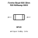

<!-- Generated item page. Full data lives in the source repository. -->
[Catalogue](../../../../../README.md) / [Electronic](../../../../README.md) / [Ferrite Bead](../../../README.md) / [0603](../../README.md) / [600 Ohm](../README.md) / 500 Milliamp

# ⚡ Ferrite Bead 600 Ohm 500 Milliamp 0603

> Ferrite Bead 600 Ohm 500 Milliamp 0603 is an OOMP electronic ferrite bead definition. It uses the 0603 package or form factor. Its nominal drawing size is 1.6 × 0.8 mm.

**[Full details →](https://github.com/oomlout/oomp_electronic_version_5/tree/main/parts/electronic_ferrite_bead_0603_600_ohm_500_milliamp)**

## At a glance

| Detail | Value |
| --- | --- |
| Type | Ferrite Bead |
| Package / style | 0603 |
| Nominal size | 1.6 × 0.8 mm |
| OOMP ID | `electronic_ferrite_bead_0603_600_ohm_500_milliamp` |

## Catalogue location

`Electronic › Ferrite Bead › 0603 › 600 Ohm › 500 Milliamp`

## About this page

This is the compact catalogue view. A detailed source README is available. Schematics, fabrication data, working metadata, alternate diagrams, availability data, and project analysis stay with the [full original record](https://github.com/oomlout/oomp_electronic_version_5/tree/main/parts/electronic_ferrite_bead_0603_600_ohm_500_milliamp).

---

[↑ Parent category](../README.md) · [Catalogue home](../../../../../README.md)
