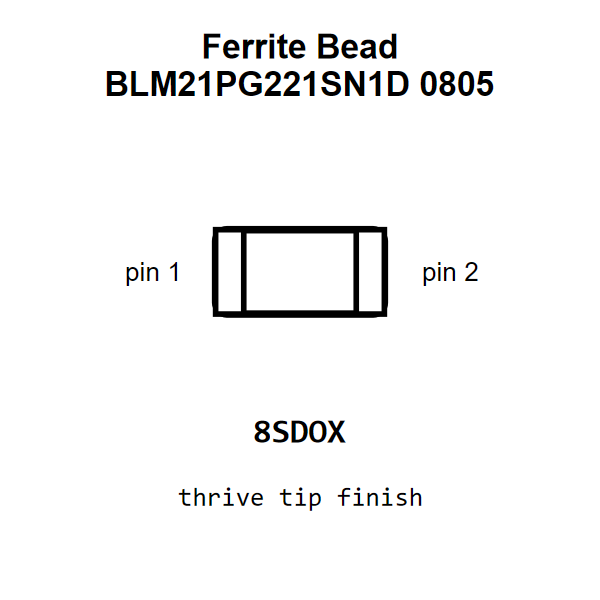

<!-- Generated item page. Full data lives in the source repository. -->
[Catalogue](../../../../../../../README.md) / [Electronic](../../../../../../README.md) / [Ferrite Bead](../../../../../README.md) / [0805](../../../../README.md) / [220 Ohm](../../../README.md) / [2 Amp](../../README.md) / [Murata](../README.md) / Blm21pg221sn1d

# ⚡ Ferrite Bead BLM21PG221SN1D 0805

> Ferrite Bead BLM21PG221SN1D 0805 is an OOMP electronic ferrite bead definition. It uses the 0805 package or form factor. Its nominal drawing size is 2.0 × 1.25 mm.

[Full details →](https://github.com/oomlout/oomp_electronic_version_5/tree/main/parts/electronic_ferrite_bead_0805_220_ohm_2_amp_murata_blm21pg221sn1d)

## At a glance

| Detail | Value |
| --- | --- |
| Type | Ferrite Bead |
| Package / style | 0805 |
| Nominal size | 2.0 × 1.25 mm |
| OOMP ID | `electronic_ferrite_bead_0805_220_ohm_2_amp_murata_blm21pg221sn1d` |

## Catalogue location

`Electronic › Ferrite Bead › 0805 › 220 Ohm › 2 Amp › Murata › Blm21pg221sn1d`

## About this page

This is the compact catalogue view. A detailed source README is available. Schematics, fabrication data, working metadata, alternate diagrams, availability data, and project analysis stay with the [full original record](https://github.com/oomlout/oomp_electronic_version_5/tree/main/parts/electronic_ferrite_bead_0805_220_ohm_2_amp_murata_blm21pg221sn1d).

---

[↑ Parent category](../README.md) · [Catalogue home](../../../../../../../README.md)
