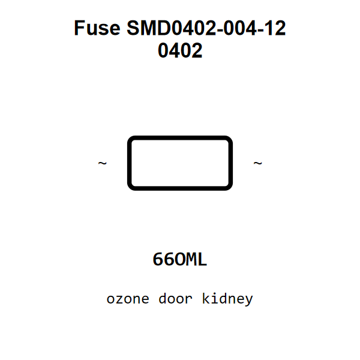

<!-- Generated item page. Full data lives in the source repository. -->
[Catalogue](../../../../README.md) / [Electronic](../../../README.md) / [Fuse](../../README.md) / [0402](../README.md) / Resettable

# ⚡ Fuse SMD0402-004-12 0402

> Fuse SMD0402-004-12 0402 is an OOMP electronic fuse definition. It uses the 0402 package or form factor. Its nominal drawing size is 1.0 × 0.5 mm. The definition includes 2 documented pins.

[Full details →](https://github.com/oomlout/oomp_electronic_version_5/tree/main/parts/electronic_fuse_0402_resettable)

## At a glance

| Detail | Value |
| --- | --- |
| Type | Fuse |
| Package / style | 0402 |
| Nominal size | 1.0 × 0.5 mm |
| Documented pins | 2 |
| OOMP ID | `electronic_fuse_0402_resettable` |

## Catalogue location

`Electronic › Fuse › 0402 › Resettable`

## About this page

This is the compact catalogue view. A detailed source README is available. Schematics, fabrication data, working metadata, alternate diagrams, availability data, and project analysis stay with the [full original record](https://github.com/oomlout/oomp_electronic_version_5/tree/main/parts/electronic_fuse_0402_resettable).

---

[↑ Parent category](../README.md) · [Catalogue home](../../../../README.md)
