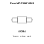

<!-- Generated item page. Full data lives in the source repository. -->
[Catalogue](../../../../../../README.md) / [Electronic](../../../../../README.md) / [Fuse](../../../../README.md) / [0603](../../../README.md) / [Resettable](../../README.md) / [Bourns](../README.md) / Mf Fsmf

# ⚡ Fuse MF-FSMF 0603

> Fuse MF-FSMF 0603 is an OOMP electronic fuse definition. It uses the 0603 package or form factor. Its nominal drawing size is 1.6 × 0.8 mm. The definition includes 2 documented pins.

**[Full details →](https://github.com/oomlout/oomp_electronic_version_5/tree/main/parts/electronic_fuse_0603_resettable_bourns_mf_fsmf)**

## At a glance

| Detail | Value |
| --- | --- |
| Type | Fuse |
| Package / style | 0603 |
| Nominal size | 1.6 × 0.8 mm |
| Documented pins | 2 |
| OOMP ID | `electronic_fuse_0603_resettable_bourns_mf_fsmf` |

## Catalogue location

`Electronic › Fuse › 0603 › Resettable › Bourns › Mf Fsmf`

## About this page

This is the compact catalogue view. A detailed source README is available. Schematics, fabrication data, working metadata, alternate diagrams, availability data, and project analysis stay with the [full original record](https://github.com/oomlout/oomp_electronic_version_5/tree/main/parts/electronic_fuse_0603_resettable_bourns_mf_fsmf).

---

[↑ Parent category](../README.md) · [Catalogue home](../../../../../../README.md)
